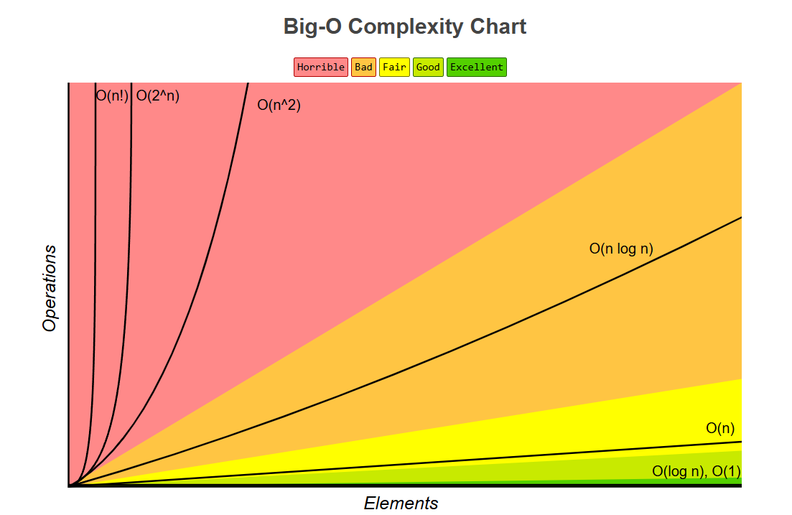
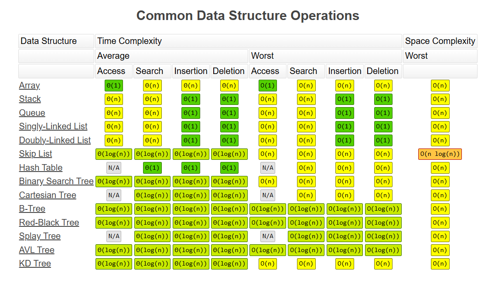
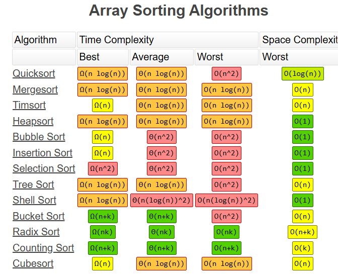
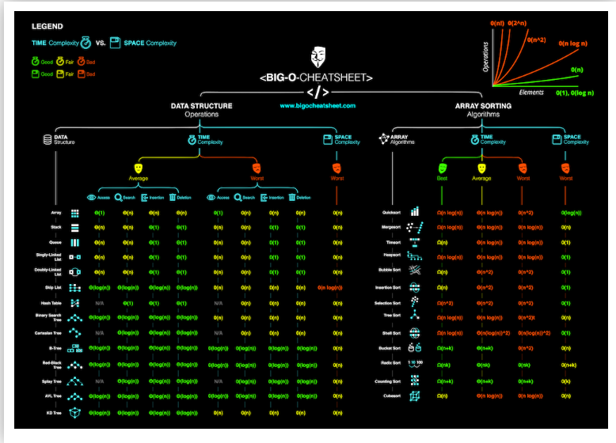

O(n^2) is called Loop within a Loop (Most Inefficient )
O(n) is called propotional (better than previous)
O(log(n)) is called Divide and Conquer Very efficient
O(1) is called constant most efficient 
Goto https://www.bigocheatsheet.com/

