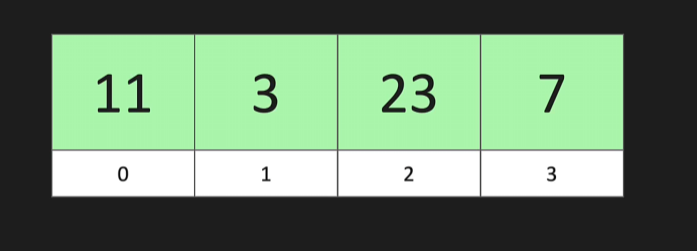
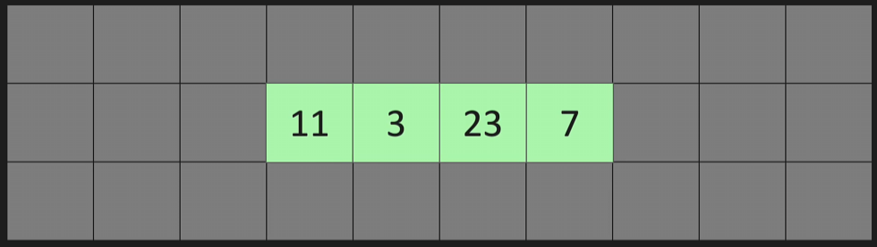
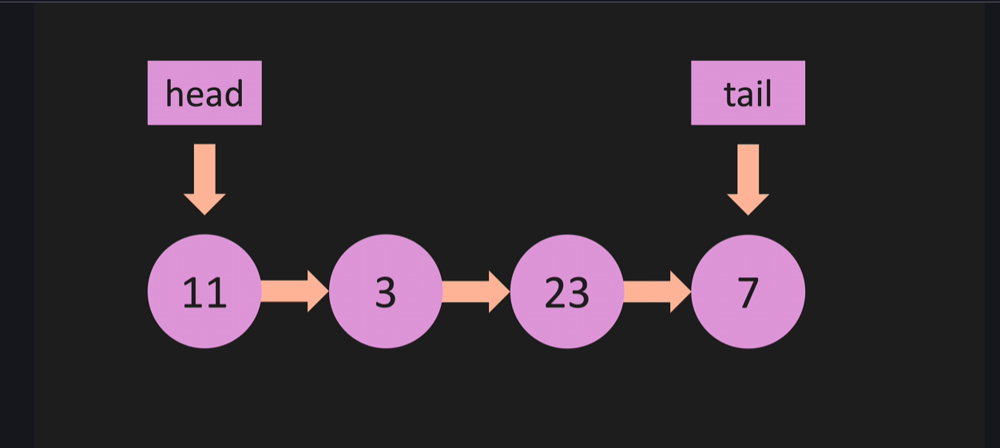
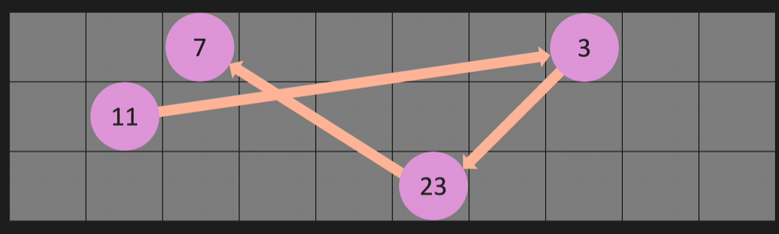
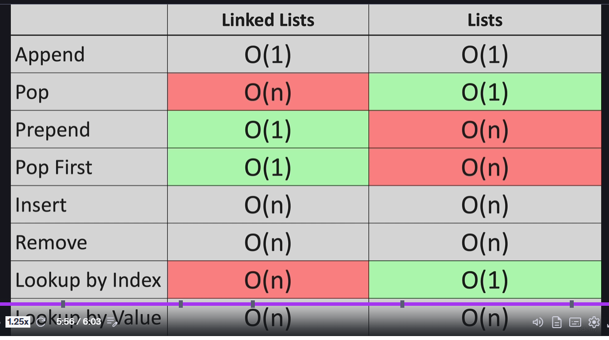

This is how a regular list is stored 
It has Index for every value, and all the values are stored next to each other

How a linked list is stored 
It dosen't have a index, it has a head and a tail 

Append at the end O(1)
Delete from the end O(n)
add to front O(1)
delete from front O(1)
add in middle O(n)
remove from the middle O(n)
Lookup for an element O(n)

